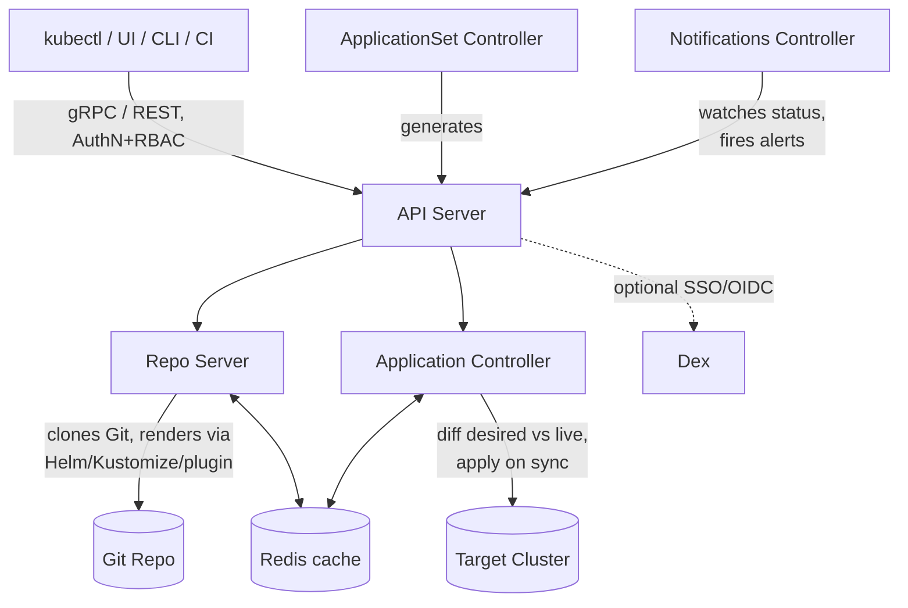
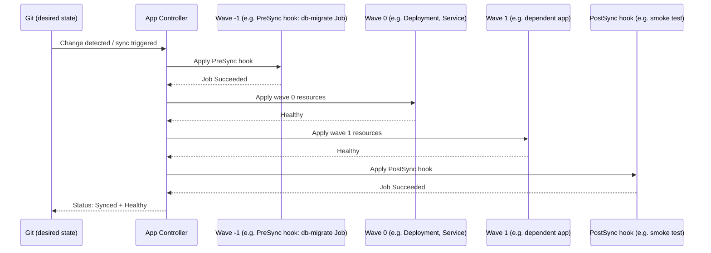

# ArgoCD — The Complete Reference Guide

*A from-scratch-to-pro reference for a mid-level DevOps engineer. Every concept explained with theory, YAML, and real scenarios, plus a full command cheat sheet.*

---

## Table of Contents

1. [What Is ArgoCD & GitOps](#1-what-is-argocd--gitops)
2. [Architecture Deep Dive](#2-architecture-deep-dive)
3. [Installation](#3-installation)
4. [The Application CRD](#4-the-application-crd)
5. [Sync Policies, Strategies & Hooks](#5-sync-policies-strategies--hooks)
6. [Sources: Git, Helm, Kustomize, Plugins](#6-sources-git-helm-kustomize-plugins)
7. [App-of-Apps & ApplicationSets](#7-app-of-apps--applicationsets)
8. [Projects & RBAC](#8-projects--rbac)
9. [Multi-Tenancy Patterns](#9-multi-tenancy-patterns)
10. [Notifications & Observability](#10-notifications--observability)
11. [Secrets Management in GitOps](#11-secrets-management-in-gitops)
12. [Progressive Delivery (Argo Rollouts)](#12-progressive-delivery-argo-rollouts)
13. [Troubleshooting Playbook](#13-troubleshooting-playbook)
14. [Disaster Recovery & Drift](#14-disaster-recovery--drift)
15. [Full CLI Command Cheat Sheet](#15-full-cli-command-cheat-sheet)
16. [Best Practices Checklist](#16-best-practices-checklist)
17. [Advanced Topics & Ecosystem Tools](#17-advanced-topics--ecosystem-tools)
18. [Production-Grade Reference Projects](#18-production-grade-reference-projects)

---

## 1. What Is ArgoCD & GitOps

### 1.1 The problem it solves
Traditional CD pipelines (Jenkins running `kubectl apply` or `helm upgrade`) push changes *into* the cluster. Two problems follow:
- **No single source of truth**: the cluster's actual state can drift from what's in Git, and nothing notices.
- **Push credentials live outside the cluster**: your CI system needs broad kube-apiserver access, which is a security liability.

**GitOps** flips this: Git is the *desired state*. An in-cluster agent continuously compares live state to Git and reconciles differences — a **pull-based** model.

### 1.2 What ArgoCD actually is
ArgoCD is a **declarative, GitOps continuous delivery tool for Kubernetes**. It runs *inside* your cluster (or a management cluster) as a set of controllers. It does not build or test your code — that's CI's job. ArgoCD's job starts after CI pushes a new image tag / manifest to a Git repo:

```
CI (Jenkins) → builds image, pushes to ECR, updates manifest/values in Git repo
ArgoCD       → detects the Git change → renders manifests → diffs vs cluster → applies
```

### 1.3 Core GitOps principles (Argo's own definition)
1. **Declarative** — the entire system is described declaratively.
2. **Versioned & immutable** — desired state is stored in Git, giving full history & rollback.
5. **Pulled automatically** — software agents automatically pull the desired state from Git.
4. **Continuously reconciled** — agents continuously observe actual state and alert/correct on divergence.

### 1.4 Where ArgoCD fits in your stack
Given your stack (EKS, Jenkins, Helm, Terraform, ECR, Bitbucket):
- **Terraform** provisions the EKS cluster, IAM, VPC — infrastructure, not app deployment.
- **Jenkins** builds the app, runs tests, builds/pushes the Docker image to ECR, and updates the Helm `values.yaml` (image tag) in a Git repo — it does **not** run `helm upgrade` against the cluster.
- **ArgoCD** watches that Git repo and applies the change to EKS.
- **Bitbucket** is the Git source ArgoCD polls/webhooks.

### 1.5 Sync status vs Health status — the single most important mental model
ArgoCD tracks **two independent axes** for every Application:

| Axis | Question it answers | Example values |
|---|---|---|
| **Sync Status** | Does live state match Git? | `Synced`, `OutOfSync`, `Unknown` |
| **Health Status** | Is the resource actually working? | `Healthy`, `Progressing`, `Degraded`, `Suspended`, `Missing`, `Unknown` |

**Scenario:** You deploy a Deployment with a bad image tag. ArgoCD applies it exactly as Git says → **Synced**. But the pods CrashLoopBackOff → **Degraded**. A green "Synced" badge does NOT mean your app is healthy. This trips up almost every engineer new to ArgoCD.

---

## 2. Architecture Deep Dive

### 2.1 Core components


*(This renders as a live diagram on GitHub/GitLab and most Markdown viewers that support Mermaid. Below is the same picture as plain ASCII for anywhere Mermaid isn't supported.)*

```
                        ┌─────────────────────┐
   kubectl/UI/CLI ───▶  │   API Server         │◀── gRPC/REST, AuthN/AuthZ, RBAC enforcement
                        └──────────┬───────────┘
                                   │
                ┌──────────────────┼──────────────────┐
                ▼                  ▼                   ▼
     ┌──────────────────┐ ┌────────────────┐ ┌──────────────────┐
     │ Repo Server       │ │ App Controller  │ │ Dex (optional)    │
     │ (clones git,      │ │ (reconciliation │ │ SSO / OIDC bridge │
     │  renders manifests│ │  loop, diffing, │ └──────────────────┘
     │  via helm/kustomize│ │  sync execution)│
     │  /plugins)         │ └────────────────┘
     └──────────────────┘         │
                ▲                 ▼
                │        ┌──────────────────┐
                └────────│      Redis        │  caches manifests, app state
                         └──────────────────┘
```

- **API Server** — gRPC/REST server the UI, CLI, and CI systems talk to. Handles auth, RBAC, and exposes Application/Project management.
- **Repository Server** — internal service that clones Git repos, and generates final Kubernetes manifests from Helm charts, Kustomize overlays, plugins, or plain YAML. This is where "rendering" happens — it never touches the live cluster.
- **Application Controller** — a Kubernetes controller (control loop) that:
  1. Continuously watches live cluster state for every registered `Application`.
  2. Compares live state to the desired manifests from the Repo Server (the **diff**).
  3. Reports Sync/Health status.
  4. Executes `sync` operations (applies changes) when triggered (manually or via automated sync policy).
- **Redis** — caching layer for cluster state and rendered manifests, keeps the controller fast.
- **Dex** — optional identity broker enabling SSO via OIDC/SAML/LDAP/GitHub/etc. Not required — ArgoCD has local users too.
- **ApplicationSet Controller** — separate controller (installed alongside) that generates multiple `Application` resources from templates (see §7).
- **Notifications Controller** — separate controller that watches Application state changes and fires alerts (Slack, email, webhook) (see §10).

### 2.2 How reconciliation actually works (the loop)
1. Repo Server polls Git (default every 3 min) or receives a webhook.
2. On change, Repo Server renders manifests fresh (helm template / kustomize build / raw YAML).
3. Application Controller diffs rendered manifests against live cluster objects using **server-side diff** logic (respects K8s defaulting, so it doesn't falsely report drift for fields the API server fills in).
4. Status updates: `OutOfSync` if diff exists, `Synced` if not.
5. If `automated` sync policy is set → controller triggers a sync automatically. Otherwise, it waits for a human/CI to click Sync or run `argocd app sync`.

### 2.3 Resource tracking — how ArgoCD knows what it owns
ArgoCD marks every resource it manages with:
- Label: `app.kubernetes.io/instance: <app-name>` (or annotation-based tracking, configurable)
- This is how it computes "belongs to this Application" during diffing and pruning.

**Scenario — two Applications fighting over the same resource:** If two `Application` objects both declare the same Deployment (e.g., copy-pasted manifests, wrong path), each sync overwrites the other's version of the resource, and both show perpetual `OutOfSync`. Fix: ensure each resource is owned by exactly one Application; use distinct label values or non-overlapping Git paths.

---

## 3. Installation

### 3.1 Option A — Plain manifests (fastest, good for dev/learning)
```bash
kubectl create namespace argocd
kubectl apply -n argocd -f https://raw.githubusercontent.com/argoproj/argo-cd/stable/manifests/install.yaml
```
Use `namespace-install.yaml` instead if you want ArgoCD restricted to manage only its own namespace (no cluster-wide RBAC) — common in shared/multi-tenant clusters.

### 3.2 Option B — Helm chart (recommended for prod; matches your stack)
```bash
helm repo add argo https://argoproj.github.io/argo-helm
helm repo update
helm install argocd argo/argo-cd \
  --namespace argocd --create-namespace \
  -f values-argocd.yaml
```
Why Helm in production: you can version-control `values.yaml`, tune HA replica counts, resource limits, ingress, RBAC config, and plug in the CMP sidecar (§6.4) declaratively — and this itself can be managed by... ArgoCD (an ArgoCD app that manages ArgoCD, common in mature setups).

### 3.3 Option C — ArgoCD Operator
A Kubernetes Operator (OperatorHub) that manages ArgoCD instances via a custom `ArgoCD` CRD. Common on OpenShift. More abstraction, less direct Helm-values control — pick Option B unless your platform mandates Operators.

### 3.4 Accessing ArgoCD

**CLI login:**
```bash
argocd login <ARGOCD_SERVER>:443 --username admin --password <initial-pw> --insecure
```
Initial admin password (first login only):
```bash
kubectl -n argocd get secret argocd-initial-admin-secret \
  -o jsonpath="{.data.password}" | base64 -d
```

**UI access (no ingress yet):**
```bash
kubectl port-forward svc/argocd-server -n argocd 8080:443
```

### 3.5 Common install-time failure — `CrashLoopBackOff` from stale CRDs
**Scenario:** You upgrade ArgoCD to a new minor version but forget to apply the updated CRDs (if you installed via raw manifests and only patched specific components). `argocd-application-controller` crashes on startup with CRD schema validation errors.
**Fix:**
```bash
kubectl apply -f https://raw.githubusercontent.com/argoproj/argo-cd/stable/manifests/crds/application-crd.yaml
kubectl apply -f https://raw.githubusercontent.com/argoproj/argo-cd/stable/manifests/crds/appproject-crd.yaml
```
Always upgrade CRDs *before* rolling controller images when doing manual manifest installs. The Helm chart handles this ordering for you — another reason to prefer it.

### 3.6 Common access failure — TLS / dead port-forward login failure
**Scenario:** `argocd login` hangs or fails with `transport: authentication handshake failed`. Usually one of:
- You didn't pass `--insecure` and ArgoCD's self-signed cert isn't trusted.
- The port-forward process died silently (check with `ps aux | grep port-forward`) — restart it.
- You're hitting the gRPC port through an ALB/ingress that doesn't support HTTP/2 — ArgoCD's CLI needs gRPC-Web mode: add `--grpc-web` to `argocd login`.

---

## 4. The Application CRD

Everything in ArgoCD revolves around one CRD: `Application`. It tells ArgoCD: *"here's a source of manifests, here's where to deploy them, here's how to sync."*

### 4.1 Full annotated example
```yaml
apiVersion: argoproj.io/v1alpha1
kind: Application
metadata:
  name: payments-service
  namespace: argocd                     # Applications live in the ArgoCD namespace
  finalizers:
    - resources-finalizer.argocd.argoproj.io   # ensures cascade delete of child resources
spec:
  project: retail-team                  # AppProject this belongs to (RBAC scoping, see §8)

  source:
    repoURL: https://bitbucket.org/myorg/payments-manifests.git
    targetRevision: main                # branch, tag, or commit SHA
    path: k8s/overlays/prod             # path within the repo

  destination:
    server: https://kubernetes.default.svc   # target cluster API (in-cluster here)
    namespace: payments-prod

  syncPolicy:
    automated:
      prune: true                       # delete resources removed from Git
      selfHeal: true                    # revert manual/out-of-band cluster edits
      allowEmpty: false                 # refuse to sync if manifest set becomes empty (safety)
    syncOptions:
      - CreateNamespace=true
      - PrunePropagationPolicy=foreground
      - ApplyOutOfSyncOnly=true
    retry:
      limit: 5
      backoff:
        duration: 5s
        factor: 2
        maxDuration: 3m
```

### 4.2 Field-by-field notes
- **`project`** — every Application MUST belong to a project (`default` if unspecified). Projects scope what repos/clusters/namespaces/resource-kinds an Application is allowed to touch — this is your RBAC boundary (§8).
- **`source`** vs **`sources`** — modern ArgoCD (2.6+) supports **multiple sources** per Application (e.g., a Helm chart source + a separate values-file-only Git source). Use `sources: [...]` (a list) when you need this; `source` (singular) still works for the common single-source case.
- **`destination.server`** — `https://kubernetes.default.svc` means "the cluster ArgoCD itself runs in." For multi-cluster, this is the registered cluster's API endpoint (`argocd cluster add`).
- **`syncPolicy.automated`** — omit entirely for **manual** sync (a human/CI must click Sync or run `argocd app sync`). This is the safest default for prod; add automation once you trust the pipeline.
  - `prune: true` — without this, resources deleted from Git are silently left running in the cluster forever ("orphans").
  - `selfHeal: true` — without this, someone can `kubectl edit` a live resource and ArgoCD will just report `OutOfSync` forever without fixing it. With it, ArgoCD reverts the manual change on its next reconcile (default every 3 min, or immediately on a detected change via the watch).
- **`ApplyOutOfSyncOnly=true`** — performance optimization; skips server-side apply calls for resources ArgoCD already knows are in sync.

### 4.3 Resource tracking & `ignoreDifferences`
Sometimes a controller *other than ArgoCD* mutates a field at runtime (e.g., HPA changing `spec.replicas`, a mutating webhook injecting a sidecar). Without help, ArgoCD sees this as permanent drift and flips `OutOfSync` every reconcile (or worse, `selfHeal` fights the other controller in a loop).

```yaml
spec:
  ignoreDifferences:
    - group: apps
      kind: Deployment
      jsonPointers:
        - /spec/replicas
    - group: ""
      kind: Service
      jsonPointers:
        - /spec/clusterIP
```

### 4.4 Scenario — stuck "Progressing" health
**Symptom:** Application shows `Synced` but `Progressing` forever, never turning `Healthy`.
**Root causes (in order of frequency):**
1. Deployment's `readinessProbe` never succeeds (bad health-check path/port) — pods run but K8s never marks them Ready, so the Deployment controller keeps waiting.
2. `minReadySeconds` combined with a slow-starting app makes the rollout take longer than you'd expect — not actually stuck, just slow.
3. A PVC is stuck `Pending` (no matching StorageClass/zone) and a pod referencing it never schedules.
**Debug path:**
```bash
argocd app get payments-service --show-managed-fields   # what does ArgoCD think health is
kubectl describe deploy payments-service -n payments-prod
kubectl get pods -n payments-prod -o wide
kubectl describe pod <pod> -n payments-prod   # look at Events at the bottom
```

---

## 5. Sync Policies, Strategies & Hooks

### 5.1 Manual vs Automated sync
- **Manual** (default): nothing happens on a Git change except `OutOfSync` status. A human or CI pipeline stage triggers `argocd app sync`.
- **Automated**: controller syncs on every detected Git change, no human step. Combine with `prune` and `selfHeal` as needed (§4.2).

**When to choose which:** Manual for prod environments where a change-approval gate matters; automated for dev/staging where fast feedback matters more than a gate. Many teams do **automated + selfHeal in dev**, **manual in prod**, promoted via a PR-merge-to-prod-branch step.

### 5.2 Sync waves — ordering resources within one sync
By default, ArgoCD applies resources in Kubernetes-kind-based order (Namespaces → CRDs → cluster roles → ... → Deployments → ... → Jobs), but you can force explicit ordering with **sync waves**:

```yaml
apiVersion: apps/v1
kind: Deployment
metadata:
  name: db-migration-runner
  annotations:
    argocd.argoproj.io/sync-wave: "-1"    # runs BEFORE wave "0" (default) resources
---
apiVersion: apps/v1
kind: Deployment
metadata:
  name: payments-api
  annotations:
    argocd.argoproj.io/sync-wave: "0"     # default wave, runs after wave -1 completes and is healthy
```
Rule: lower numbers sync first; a wave doesn't start until the previous wave's resources are `Healthy` (or, for resources with no health check like ConfigMaps, immediately applied).

### 5.3 Visualizing one sync — waves and hooks together


A wave never starts until every resource in the previous wave reports `Healthy` (or, for resources with no health check like a ConfigMap, as soon as it's applied). `PreSync` always runs before wave 0 begins; `PostSync` only fires once every wave is `Synced` **and** `Healthy`. If any step fails, `SyncFail` hooks (not shown above) fire instead of `PostSync`.

### 5.4 Hooks — running one-off jobs around a sync
Hooks let you run a `Job` (commonly) at specific points in the sync lifecycle:

| Hook | Runs |
|---|---|
| `PreSync` | Before the main sync applies resources — e.g., DB schema migration |
| `Sync` | Alongside the main sync (rarely used directly) |
| `PostSync` | After all resources are synced AND healthy — e.g., smoke test, cache warm-up |
| `SyncFail` | Only if the sync fails — e.g., rollback notification, cleanup |

```yaml
apiVersion: batch/v1
kind: Job
metadata:
  name: db-migrate
  annotations:
    argocd.argoproj.io/hook: PreSync
    argocd.argoproj.io/hook-delete-policy: BeforeHookCreation   # delete old Job before creating a new one
spec:
  template:
    spec:
      containers:
        - name: migrate
          image: myorg/payments-migrator:1.4.0
          command: ["flyway", "migrate"]
      restartPolicy: Never
  backoffLimit: 2
```

**`hook-delete-policy` values:**
- `HookSucceeded` — delete the Job after it succeeds.
- `HookFailed` — delete after failure.
- `BeforeHookCreation` (most common) — delete any leftover Job from a previous sync attempt before creating the new one; without this, re-running a sync fails with "Job already exists" because Job's pod template is immutable.

### 5.5 Scenario — hung PreSync hook blocks everything
**Symptom:** `argocd app sync` hangs indefinitely; Application stuck `Progressing`, no other resources applied.
**Cause:** A `PreSync` Job never completes (e.g., migration container waiting on a DB connection that's firewalled off, or crashlooping).
**Fix:**
```bash
kubectl get jobs -n <ns> -l argocd.argoproj.io/instance=<app>
kubectl logs job/db-migrate -n <ns>
argocd app terminate-op <app>     # abort the stuck sync operation
kubectl delete job db-migrate -n <ns>
```
Then fix the underlying Job (usually a network policy or secret issue) before re-syncing.

### 5.6 Scenario — hook Job not recreating without `BeforeHookCreation`
**Symptom:** Second sync attempt fails immediately with `Job.batch "db-migrate" already exists and cannot be updated` because Jobs are mostly immutable.
**Fix:** Add `argocd.argoproj.io/hook-delete-policy: BeforeHookCreation` (see 5.3) — ArgoCD then deletes the stale Job object before creating the fresh one on every sync.

---

## 6. Sources: Git, Helm, Kustomize, Plugins

### 6.1 Plain Git directory sources
```yaml
spec:
  source:
    repoURL: https://bitbucket.org/myorg/manifests.git
    targetRevision: main
    path: apps/payments
    directory:
      recurse: true          # include subdirectories
      exclude: "*/tests/*"   # glob-exclude paths you don't want rendered
```
**Revision pinning options:** branch name (`main`), tag (`v1.4.0`), or exact commit SHA — pin to a SHA for maximum reproducibility in prod; branch tracking is common in dev.

**Monorepo vs polyrepo:**
- *Monorepo* (all app manifests in one repo, `path:` distinguishes apps) — simpler repo sprawl management, but broader blast radius for repo-level permissions and a noisier commit history/webhook triggers.
- *Polyrepo* (one repo per app/team) — cleaner RBAC boundaries (Bitbucket repo permissions = deploy permissions) and independent webhook triggers, at the cost of more repos to register and maintain.

**Scenario — unwanted recursion pulling in tests/docs:** `directory.recurse: true` with no `exclude` silently renders any stray YAML under the path (e.g., a `docs/example.yaml` or a `tests/fixture.yaml`) as a real manifest, and ArgoCD tries to apply it. Fix with `exclude` globs or restructure the repo so non-manifest YAML lives outside the watched path.

**Scenario — repo connection shows `Unknown` status:** Usually a credentials problem.
```bash
argocd repo list                      # check ConnectionStatus column
argocd repo get https://bitbucket.org/myorg/manifests.git
argocd repo add https://bitbucket.org/myorg/manifests.git \
  --username svc-argocd --password <app-password> --insecure-skip-server-verification
```
For Bitbucket, use an **App Password** (not your account password) with `Repositories: Read` scope, or better, register via SSH deploy key.

### 6.2 Helm sources — the #1 misunderstanding
**ArgoCD does NOT run `helm install` / `helm upgrade`.** It runs `helm template` to render manifests, then applies the *plain YAML output* itself. Consequence: **there is no Helm release object, no `helm history`, no `helm rollback`** — rollback is a Git revert + ArgoCD sync instead.

```yaml
spec:
  source:
    repoURL: https://charts.bitnami.com/bitnami   # or an in-repo path, or an OCI registry
    chart: redis
    targetRevision: 18.6.1
    helm:
      releaseName: payments-redis        # cosmetic only — sets {{ .Release.Name }}, no real release created
      valueFiles:
        - values-prod.yaml               # applied in listed order, LAST FILE WINS on overlap
      values: |                          # inline values, HIGHEST precedence — overrides valueFiles
        replica:
          replicaCount: 3
      parameters:                        # --set style, even higher precedence than inline `values`
        - name: auth.enabled
          value: "true"
```
**Precedence (lowest → highest):** chart defaults `values.yaml` → `valueFiles` (in order) → inline `values:` block → `parameters:` (`--set`-equivalent).

**Helm hooks vs ArgoCD hooks:** ArgoCD auto-translates common Helm hook annotations (`helm.sh/hook: pre-install`) into ArgoCD's own hook/wave system so third-party charts "just work," but the mapping isn't 1:1 for every hook weight/delete-policy combination.

**Scenario — third-party chart pre-install hook silently skipped:** A community chart uses `helm.sh/hook-weight` finely tuned for real Helm's install/upgrade distinction (which ArgoCD doesn't have — everything looks like an upgrade to ArgoCD). Symptom: an init Job that chart authors expected to run once "before install" runs on every sync. Fix: read the chart's hook annotations, override with your own `PreSync` wave/hook config in a Kustomize/Helm overlay if the default translation misbehaves.

**Scenario — silent value override typo:** You set `replicaCound: 3` (typo) in `values:` — Helm doesn't error on unknown keys, it's just ignored, and the chart silently falls back to its default (often `1`). **Debug:** `argocd app manifests <app>` to see the *actual rendered* output and confirm your value took effect, don't trust the values file alone.

**OCI Helm registries — relevant since your images already live in ECR:** ArgoCD can pull Helm charts from any OCI-compliant registry, and **ECR itself can host Helm charts as OCI artifacts**, not just Docker images. This means your Helm charts can live in the same ECR repo family as your images instead of a separate chart repo.
```yaml
spec:
  source:
    repoURL: 123456789.dkr.ecr.us-east-1.amazonaws.com/helm-charts
    chart: payments-api
    targetRevision: 1.8.2
    helm:
      valueFiles:
        - values-prod.yaml
```
Register the OCI repo with credentials first (ECR needs a short-lived token, not a static password):
```bash
argocd repo add 123456789.dkr.ecr.us-east-1.amazonaws.com/helm-charts \
  --type helm --enable-oci \
  --username AWS --password "$(aws ecr get-login-password --region us-east-1)"
```
Because ECR tokens expire (12 hours), a static `argocd repo add` credential goes stale — production setups usually automate credential refresh via a CronJob updating the `argocd-repo-server`'s repo Secret, or use IRSA-based auth where supported, rather than a one-time manual `repo add`.

### 6.3 Kustomize integration
Native support, no plugin required.
```yaml
spec:
  source:
    repoURL: https://bitbucket.org/myorg/manifests.git
    path: overlays/prod
    kustomize:
      namePrefix: prod-
      images:
        - myorg/payments=123456789.dkr.ecr.us-east-1.amazonaws.com/payments:1.8.2
      commonLabels:
        environment: prod
```
Typical base+overlay layout:
```
base/
  deployment.yaml
  service.yaml
  kustomization.yaml
overlays/
  prod/
    kustomization.yaml   # references ../../base, patches replicas/resources/image
  staging/
    kustomization.yaml
```
**Scenario — local vs ArgoCD-bundled Kustomize version mismatch:** `kustomize build` works fine on your laptop but ArgoCD renders differently or errors — ArgoCD ships a *specific pinned* Kustomize binary version per ArgoCD release. Check `argocd version` output for the bundled Kustomize version and match your local one, especially around syntax that changed between Kustomize v4 and v5 (e.g., `patchesStrategicMerge` deprecated in favor of `patches`).

**Scenario — silent image override string mismatch:** `kustomize.images` uses exact string match against the image name *as written in the base manifest*. If base says `image: payments-api` but your override says `images: [myorg/payments-api=...]`, it silently fails to match and the override is a no-op. Always confirm with `argocd app manifests` after any image-override change.

### 6.4 Config Management Plugins (CMP) — when native support isn't enough
Use a CMP when you need a rendering step ArgoCD doesn't natively support — e.g., `helmfile`, `jsonnet`/`ytt`, a custom templating script, or Helm+Kustomize chained together.

**Architecture:** a CMP runs as a **sidecar container** inside the `argocd-repo-server` pod. The main repo-server process calls into the sidecar over a Unix socket when an Application references that plugin.

```yaml
# plugin.yaml — defines discovery + generate command
apiVersion: argoproj.io/v1alpha1
kind: ConfigManagementPlugin
metadata:
  name: helmfile-plugin
spec:
  version: v1.0
  discover:
    find:
      glob: "helmfile.yaml"          # only apps whose path contains this file use this plugin
  generate:
    command: ["sh", "-c"]
    args: ["helmfile template --quiet"]
```
Wiring the sidecar into `argocd-repo-server` (via the Helm chart):
```yaml
# values-argocd.yaml
repoServer:
  extraContainers:
    - name: helmfile-plugin
      image: myorg/helmfile-cmp:1.0
      command: ["/var/run/argocd/argocd-cmp-server"]
      volumeMounts:
        - name: plugins
          mountPath: /home/argocd/cmp-server/plugins
        - name: cmp-tmp
          mountPath: /tmp
  volumes:
    - name: cmp-tmp
      emptyDir: {}
```
Reference it from an Application:
```yaml
spec:
  source:
    plugin:
      name: helmfile-plugin
      env:
        - name: HELM_VALUES_ENV
          value: prod
```
`plugin.env` lets each Application parameterize the same plugin differently — e.g., different environments picking different values files inside the same `generate` script.

**Scenario — plugin never invoked due to glob mismatch:** `discover.find.glob` doesn't match your actual file layout (e.g., `helmfile.yaml` sits one directory up from `path:`), so ArgoCD silently falls back to treating the directory as plain YAML — often erroring on the raw `helmfile.yaml` file itself ("cannot parse as Kubernetes object"). Fix: verify the glob against the exact `path:` ArgoCD checks out, or use `discover.fileName` for a simpler exact match.

**Scenario — stdout log contamination breaking YAML:** Your `generate` script accidentally prints a log line (`Fetching dependencies...`) to stdout instead of stderr. ArgoCD treats *all* stdout as the manifest output, so that log line corrupts the YAML stream and the whole render fails with a parse error. **Fix:** redirect all diagnostic/log output to stderr (`>&2`) in the plugin script — stdout must be pure manifest YAML.

---

## 7. App-of-Apps & ApplicationSets

Both solve the same underlying problem: **you have many Applications (per env, per team, per cluster) and don't want to hand-create each one.** They differ in mechanism.

### 7.1 App-of-Apps pattern
One **parent** `Application` whose "manifests" are actually *other* `Application` resources (child apps), stored as plain YAML in a folder.

```yaml
# parent Application
apiVersion: argoproj.io/v1alpha1
kind: Application
metadata:
  name: root-app
  namespace: argocd
spec:
  project: default
  source:
    repoURL: https://bitbucket.org/myorg/gitops-config.git
    targetRevision: main
    path: apps/           # this folder contains child Application YAMLs, NOT app workloads
  destination:
    server: https://kubernetes.default.svc
    namespace: argocd
  syncPolicy:
    automated:
      prune: true
      selfHeal: true
```
```
apps/
  payments-app.yaml       # kind: Application, points to actual payments manifests
  inventory-app.yaml      # kind: Application, points to actual inventory manifests
  notifications-app.yaml
```
**Bootstrap:** you manually `argocd app create`/`kubectl apply` the *one* parent app once ("day-0"); everything else — every child Application and every real workload — is created automatically from Git after that. This single bootstrap step is unavoidable (something has to create the first Application).

**Ordering:** use sync-wave annotations on the child `Application` YAMLs themselves if children must come up in a specific order (e.g., a shared `namespaces-app` before workload apps).

**Where App-of-Apps strains:** it's static — every child app is a literal file you commit. Great for "5 known apps," painful for "generate one Application per one of 40 clusters" or "per PR preview environment," which is exactly what ApplicationSets solve.

**Scenario — missing cascade-delete finalizer orphaning resources:** Deleting the parent Application (or a child's YAML file) without the `resources-finalizer.argocd.argoproj.io` finalizer on the child Applications leaves their *own* child workloads (Deployments, Services) running forever — ArgoCD just forgets about them, doesn't delete them. Always include the finalizer (§4.1) on Applications you intend to fully cascade-delete.

**Scenario — self-heal reverting manual CLI drift on a child app:** An engineer runs `kubectl scale deploy payments-api --replicas=10` directly for an incident. Thirty seconds later, `selfHeal: true` on the child Application reverts it back to Git's `replicas: 3`, undoing the emergency fix. **Fix / process note:** for genuine emergency overrides, either (a) temporarily disable auto-sync (`argocd app set <app> --sync-policy none`), fix, then re-enable after updating Git, or (b) fix it in Git first via an expedited PR and let ArgoCD apply it — never fight selfHeal with kubectl.

### 7.2 ApplicationSets — templated, dynamic generation
An `ApplicationSet` uses **generators** to produce a *set* of `Application` resources from a template — dynamically, based on external data (a list, a Git directory structure, a cluster list, a matrix of both).

```yaml
apiVersion: argoproj.io/v1alpha1
kind: ApplicationSet
metadata:
  name: payments-per-env
  namespace: argocd
spec:
  generators:
    - list:
        elements:
          - env: dev
            replicas: "1"
          - env: staging
            replicas: "2"
          - env: prod
            replicas: "5"
  template:
    metadata:
      name: 'payments-{{env}}'
    spec:
      project: default
      source:
        repoURL: https://bitbucket.org/myorg/manifests.git
        targetRevision: main
        path: 'overlays/{{env}}'
      destination:
        server: https://kubernetes.default.svc
        namespace: 'payments-{{env}}'
      syncPolicy:
        automated:
          prune: true
          selfHeal: true
```

**Git generator** — auto-discovers `Application`s from repo structure, two flavors:
```yaml
generators:
  - git:
      repoURL: https://bitbucket.org/myorg/manifests.git
      revision: main
      directories:
        - path: "overlays/*"       # one Application per matching directory
---
generators:
  - git:
      repoURL: https://bitbucket.org/myorg/manifests.git
      revision: main
      files:
        - path: "apps/**/config.json"   # one Application per matching file, parsed as generator params
```
Directory generator = "one app per folder," ideal when adding a new environment/service is "add a folder." File generator = when you need richer per-app metadata (JSON/YAML params file) beyond just a folder name.

**Cluster generator** — one Application per registered cluster (fleet management):
```yaml
generators:
  - clusters:
      selector:
        matchLabels:
          env: prod          # only clusters registered with this label
```

**Matrix generator** — cartesian product of two generators, e.g., "every app × every cluster":
```yaml
generators:
  - matrix:
      generators:
        - list:
            elements:
              - app: payments
              - app: inventory
        - clusters:
            selector:
              matchLabels: {env: prod}
```
This produces `payments` and `inventory` Applications on *every* matching cluster — the classic multi-cluster fleet pattern.

**App-of-Apps vs ApplicationSets — when to use which:**

| | App-of-Apps | ApplicationSets |
|---|---|---|
| Best for | Small, fixed, hand-picked set of apps | Large/dynamic sets (per-cluster, per-PR, per-tenant) |
| Change process | Add a new YAML file per app | Add one row to a generator list, or nothing (Git/cluster generators auto-discover) |
| Extra controller | No (uses core Application CRD only) | Yes (`applicationset-controller`) |
| Templating | None (each child is a full literal manifest) | Go-template style `{{ }}` placeholders |

---

## 8. Projects & RBAC

### 8.1 Why `AppProject` exists
The `default` project has no restrictions — any Application in it can deploy to any repo, any cluster, any namespace, any resource kind. That's fine for a demo, dangerous for a shared multi-team cluster. `AppProject` is the guardrail.

```yaml
apiVersion: argoproj.io/v1alpha1
kind: AppProject
metadata:
  name: retail-team
  namespace: argocd
spec:
  description: "Retail team's applications — payments, inventory"
  sourceRepos:
    - "https://bitbucket.org/myorg/retail-*"       # only repos matching this pattern
  destinations:
    - server: https://kubernetes.default.svc
      namespace: "retail-*"                        # only namespaces matching this pattern
  clusterResourceWhitelist:
    - group: ""
      kind: Namespace                               # allow creating Namespaces
  namespaceResourceBlacklist:
    - group: ""
      kind: ResourceQuota                            # deny touching ResourceQuota even in-namespace
  roles:
    - name: developer
      description: "Can sync, can't delete"
      policies:
        - p, proj:retail-team:developer, applications, sync, retail-team/*, allow
        - p, proj:retail-team:developer, applications, get, retail-team/*, allow
      groups:
        - retail-team-devs      # maps to an SSO/OIDC group via Dex
```

### 8.2 Key restriction fields
- **`sourceRepos`** — whitelist of Git repos Applications in this project may pull from.
- **`destinations`** — whitelist of (cluster, namespace) pairs Applications may deploy to.
- **`clusterResourceWhitelist` / `namespaceResourceBlacklist`** — control which *kinds* of Kubernetes resources are allowed. By default cluster-scoped resources (ClusterRole, CustomResourceDefinition, Namespace) are **denied** unless explicitly whitelisted — an intentional safety default so a compromised/misconfigured app can't grant itself cluster-admin.
- **`roles`** — project-scoped RBAC roles referencing ArgoCD's built-in policy CSV syntax (`p, subject, resource, action, object, effect`), typically bound to SSO groups.

### 8.3 Global RBAC (`argocd-rbac-cm`)
Separate from per-project roles: instance-wide policy controlling who can create Projects, manage clusters/repos, or act as admin.
```yaml
apiVersion: v1
kind: ConfigMap
metadata:
  name: argocd-rbac-cm
  namespace: argocd
data:
  policy.default: role:readonly
  policy.csv: |
    p, role:org-admin, applications, *, */*, allow
    p, role:org-admin, clusters, *, *, allow
    g, myorg-platform-team, role:org-admin
```
`policy.default` sets the fallback role for any authenticated user not matched by an explicit rule — set this to `role:readonly` (never leave it as unrestricted admin) as a safety baseline.

---

## 9. Multi-Tenancy Patterns

Three common shapes, increasing isolation:

1. **Namespace-per-team, single ArgoCD instance, Projects for isolation** — cheapest, works for most orgs. Rely entirely on `AppProject` boundaries (§8). Risk: a misconfigured `clusterResourceWhitelist` or an ArgoCD RBAC mistake can cross team boundaries.
2. **ArgoCD instance-per-team (or per-BU)** — each team runs its own ArgoCD (own namespace or own cluster). Full isolation, but N× the operational overhead (upgrades, HA, monitoring, ×N).
3. **Hub-and-spoke (management cluster + registered workload clusters)** — one central ArgoCD (the "hub") registers many target clusters (`argocd cluster add`) and deploys to all of them, often via ApplicationSet cluster/matrix generators (§7.2). Common for platform teams managing many workload/customer clusters. Isolation here comes from Projects restricting which Applications can target which clusters.

For your context (enterprise delivery, single client, onsite-offshore model) — pattern 1 (Projects-based) is most common unless the client runs genuinely separate business units each wanting operational independence, in which case pattern 3 with per-BU Projects is typical.

### 9.1 Pattern 1 in full — namespace-per-team on one ArgoCD instance
This is the pattern you'll actually configure most often, so it's worth seeing end-to-end rather than just described. Two teams (`retail` and `warehouse`) share one ArgoCD instance and one cluster, each confined to their own namespaces and repos:

```yaml
apiVersion: argoproj.io/v1alpha1
kind: AppProject
metadata:
  name: retail-team
  namespace: argocd
spec:
  sourceRepos: ["https://bitbucket.org/myorg/retail-*"]
  destinations:
    - server: https://kubernetes.default.svc
      namespace: "retail-*"
  roles:
    - name: developer
      groups: [retail-team-devs]
      policies:
        - p, proj:retail-team:developer, applications, sync, retail-team/*, allow
---
apiVersion: argoproj.io/v1alpha1
kind: AppProject
metadata:
  name: warehouse-team
  namespace: argocd
spec:
  sourceRepos: ["https://bitbucket.org/myorg/warehouse-*"]
  destinations:
    - server: https://kubernetes.default.svc
      namespace: "warehouse-*"
  roles:
    - name: developer
      groups: [warehouse-team-devs]
      policies:
        - p, proj:warehouse-team:developer, applications, sync, warehouse-team/*, allow
```
Each team's `Application` objects declare `spec.project: retail-team` (or `warehouse-team`) — ArgoCD then rejects, at admission time, any Application in `retail-team` that tries to source from a `warehouse-*` repo or deploy into a `warehouse-*` namespace, regardless of what a developer's `kubectl`/UI access looks like. The isolation is enforced by the Application Controller itself, not by convention.

### 9.2 Scenario — a team "escapes" its namespace boundary
**Symptom:** A developer on the retail team creates an Application (or edits an existing one) with `destination.namespace: warehouse-prod`, and it actually deploys there — namespace isolation you thought existed didn't.
**Root cause:** The `retail-team` AppProject's `destinations` list used a namespace pattern that was too permissive (e.g., `"*"` left in from initial setup, or `"retail*"` without the hyphen, which also matches an unintended `retailops-` namespace) — `destinations` matching is glob-based, and a sloppy pattern silently widens the blast radius.
**Fix / verification:**
```bash
argocd proj get retail-team                          # inspect the actual destinations list
argocd app get <app> -o jsonpath='{.spec.project}'   # confirm which project an app actually belongs to
```
Tighten the glob (`retail-*` not `retail*`), and treat `AppProject.spec.destinations` changes with the same review rigor as IAM policy changes — this is your actual tenancy boundary, not the Kubernetes RBAC on the namespace.

### 9.3 Scenario — noisy-neighbor repo-server contention
**Symptom:** One team's Applications (e.g., a very large monorepo with dozens of Helm charts) sync slowly, and this shows up as *degraded sync latency for every other team too* — even though projects are correctly isolated for access control.
**Root cause:** `AppProject` isolates *permissions*, not *compute*. All teams on one ArgoCD instance share the same `argocd-repo-server` pod(s) for manifest rendering; one team's heavy/slow renders (huge charts, slow Git fetches) can starve the shared repo-server of CPU/memory, delaying everyone's syncs.
**Fix:** Scale `argocd-repo-server` horizontally (it's stateless — safe to run multiple replicas behind the Service), and set resource requests/limits so one heavy chart render can't starve others. If one team's rendering load is disproportionately large, that's a signal to consider pattern 2 (instance-per-team) or at least a dedicated repo-server deployment for that team, rather than tuning forever.

---

## 10. Notifications & Observability

### 10.1 Notifications controller
Separate controller watching Application state transitions (sync succeeded, health degraded, etc.) and firing configured alerts.

```yaml
# argocd-notifications-cm ConfigMap
apiVersion: v1
kind: ConfigMap
metadata:
  name: argocd-notifications-cm
  namespace: argocd
data:
  service.slack: |
    token: $slack-token             # references a key in argocd-notifications-secret
  template.app-sync-failed: |
    message: |
      :x: Application {{.app.metadata.name}} sync failed.
      Repo: {{.app.spec.source.repoURL}}
  trigger.on-sync-failed: |
    - when: app.status.operationState.phase in ['Error', 'Failed']
      send: [app-sync-failed]
```
Subscribe an Application to a trigger via annotation:
```yaml
metadata:
  annotations:
    notifications.argoproj.io/subscribe.on-sync-failed.slack: platform-alerts
```
Built-in triggers cover: `on-deployed`, `on-health-degraded`, `on-sync-failed`, `on-sync-running`, `on-sync-status-unknown`. You can define custom triggers with any expression over `app.status`.

### 10.2 Observability — metrics
Both the Application Controller and Repo Server expose Prometheus metrics (`/metrics` endpoint, typically ports `8082`/`8084`). Key metrics to dashboard/alert on:
- `argocd_app_info{sync_status="OutOfSync"}` — count of out-of-sync apps (drift/pending-deploy visibility).
- `argocd_app_info{health_status="Degraded"}` — apps that are broken right now.
- `argocd_app_reconcile_bucket` — reconciliation loop duration histogram; rising values indicate controller under load (too many Applications for one controller, or a slow Git/Helm render).
- `argocd_git_request_duration_seconds` — Git operation latency, useful for diagnosing repo-server bottlenecks.

Community **Grafana dashboards** for ArgoCD (dashboard ID 14584 and others) plot these directly — a common addition to an existing Prometheus/Grafana stack rather than building from scratch.

### 10.3 UI/CLI-level observability
```bash
argocd app list                          # sync/health at a glance across all apps
argocd app get <app> --hard-refresh      # force a fresh Git fetch + re-diff, bypassing cache
argocd app history <app>                 # deployment history (revisions synced)
argocd app diff <app>                    # show live-vs-git diff without syncing
```

---

## 11. Secrets Management in GitOps

### 11.1 The core tension
GitOps wants *everything* in Git — but plaintext Secrets in Git are a severe security risk (Git history is forever, and repo access ≠ cluster access should stay true). Three common solution families:

### 11.2 Sealed Secrets (Bitnami)
Encrypt a Secret client-side into a `SealedSecret` CRD safe to commit; a controller in-cluster holds the private key and decrypts it back into a real `Secret` at apply time.
```bash
kubeseal --format yaml < mysecret.yaml > mysealedsecret.yaml
```
```yaml
apiVersion: bitnami.com/v1alpha1
kind: SealedSecret
metadata:
  name: db-credentials
  namespace: payments-prod
spec:
  encryptedData:
    password: AgBy3i4OJSWK+PiTySYZZA9rO43cGDEQ...   # safe to commit, only decryptable by the cluster's key
```
**Pro:** simple, fully GitOps-native (the encrypted object *is* the Git artifact ArgoCD applies).
**Con:** key rotation/backup is your responsibility; losing the controller's private key means every existing SealedSecret becomes permanently undecryptable.

### 11.3 External Secrets Operator (ESO)
Secrets stay in an external store (AWS Secrets Manager, Vault, Parameter Store); a `SecretStore`/`ExternalSecret` CRD in Git tells the operator *where* to fetch from — the actual secret value never touches Git at all.
```yaml
apiVersion: external-secrets.io/v1beta1
kind: ExternalSecret
metadata:
  name: db-credentials
  namespace: payments-prod
spec:
  secretStoreRef:
    name: aws-secrets-manager
    kind: ClusterSecretStore
  target:
    name: db-credentials              # the real K8s Secret this creates
  data:
    - secretKey: password
      remoteRef:
        key: prod/payments/db-password
```
**Given your AWS/EKS stack, this is usually the most natural fit** — Secrets Manager is already the source of truth, IAM (via IRSA) controls access, and Git only ever holds a *reference*, never a value.

### 11.4 Helm Secrets / SOPS
Encrypt values files in-place with `sops` (backed by AWS KMS/GCP KMS/PGP); a repo-server plugin decrypts at render time. More Helm-native, less common than ESO in EKS-heavy shops but valid where Vault/Secrets Manager isn't already the standard.

### 11.5 What NOT to do
Never put a plain `Secret` manifest with base64-encoded (not encrypted — base64 is *not* encryption) values directly in Git. Base64 is trivially reversible; this is the single most common GitOps security mistake.

---

## 12. Progressive Delivery (Argo Rollouts)

ArgoCD deploys whatever's in Git — it doesn't itself do canary/blue-green traffic shifting. **Argo Rollouts** is a separate but sibling project (same GitHub org) that replaces the standard `Deployment` with a `Rollout` CRD supporting canary and blue-green strategies, and ArgoCD understands `Rollout` health natively.

### 12.1 Canary example
```yaml
apiVersion: argoproj.io/v1alpha1
kind: Rollout
metadata:
  name: payments-api
spec:
  replicas: 10
  strategy:
    canary:
      steps:
        - setWeight: 10          # 10% of traffic to new version
        - pause: {duration: 5m}
        - setWeight: 50
        - pause: {duration: 10m}
        - setWeight: 100
      trafficRouting:
        alb:                     # or istio / nginx / smi — matches your ingress/mesh
          ingress: payments-ingress
          servicePort: 80
  selector:
    matchLabels: {app: payments-api}
  template:
    metadata:
      labels: {app: payments-api}
    spec:
      containers:
        - name: payments-api
          image: 123456789.dkr.ecr.us-east-1.amazonaws.com/payments:1.8.2
```
Since your stack already uses AWS ALB (typical for EKS), the `alb` traffic router integrates with an existing ALB Ingress without adding a service mesh.

### 12.2 Blue-Green example (simpler mental model)
```yaml
spec:
  strategy:
    blueGreen:
      activeService: payments-active
      previewService: payments-preview
      autoPromotionEnabled: false     # require `kubectl argo rollouts promote` (manual gate)
```
New version deploys fully to `previewService` (0% live traffic) for validation, then a single cutover flips `activeService`'s selector — instant full switch, easy instant rollback (`abort` flips back).

### 12.3 How this interacts with ArgoCD
ArgoCD treats the `Rollout` object like any other Kubernetes resource — it applies the spec from Git and reports the Rollout's `Healthy`/`Progressing`/`Degraded` status same as it does for Deployments (via the Rollout's own health check logic, built into ArgoCD's resource health assessment). Promoting/aborting a canary is usually done via the `kubectl argo rollouts` plugin or its own UI dashboard — a layer on top of, not a replacement for, ArgoCD sync.

```bash
kubectl argo rollouts get rollout payments-api --watch
kubectl argo rollouts promote payments-api
kubectl argo rollouts abort payments-api
```

---

## 13. Troubleshooting Playbook

A structured order of operations for "my Application is unhappy":

### 13.1 Step 1 — What does ArgoCD think is happening?
```bash
argocd app get <app>                     # sync + health status, resource tree summary
argocd app get <app> -o yaml             # full status object, conditions
argocd app resources <app>               # every managed resource + its individual health
```

### 13.2 Step 2 — Is it a rendering problem or a live-cluster problem?
```bash
argocd app manifests <app>               # what ArgoCD WOULD apply — catches bad templating/values
argocd app diff <app>                    # live vs desired — catches drift
```
If `manifests` output looks wrong → problem is upstream (bad values, bad Kustomize overlay, bad Git content). If `manifests` looks right but `diff` shows unexpected differences → problem is live-cluster (manual edits, another controller mutating fields, admission webhook rewriting the object).

### 13.3 Step 3 — Standard Kubernetes-level debugging
```bash
kubectl get pods -n <ns> -o wide
kubectl describe pod <pod> -n <ns>       # Events section at the bottom is usually the answer
kubectl logs <pod> -n <ns> --previous    # logs from the crashed instance, not the restarted one
kubectl get events -n <ns> --sort-by=.lastTimestamp
```

### 13.4 Common failure signatures, cheat table

| Symptom | Likely cause | Where to look |
|---|---|---|
| `ComparisonError` in UI | Repo server can't render (bad Helm/Kustomize syntax, missing chart) | `argocd app manifests`, repo-server logs |
| Stuck `Progressing` forever | Failing readiness probe, unschedulable pod (PVC/resources) | `kubectl describe pod` Events |
| `OutOfSync` right after a successful sync | `ignoreDifferences` missing for a field another controller mutates | Compare `diff` output field-by-field |
| `Unknown` sync status | Repo connectivity broken, or destination cluster unreachable | `argocd repo list`, `argocd cluster list` |
| Sync succeeds but old pods still running | `RollingUpdate` maxSurge/maxUnavailable too conservative, or PodDisruptionBudget blocking | `kubectl rollout status`, check PDB |
| `repo-server` OOMKilled | Very large chart/monorepo rendering exceeds memory limits | Repo-server pod resource requests/limits, consider `sources.helm` render caching or splitting monorepo |
| Two apps show conflicting perpetual diffs | Overlapping resource ownership (§2.3) | `app.kubernetes.io/instance` label on the resource — check both apps aren't targeting the same object |
| `argocd-server` `CrashLoopBackOff` after upgrade | CRDs not upgraded before controller image (§3.5) | `kubectl apply` the new CRD manifests first |
| Login/CLI `authentication handshake failed` | Missing `--insecure`/`--grpc-web`, dead port-forward, ALB HTTP/2 issue (§3.6) | Check port-forward process, add `--grpc-web` |
| Hook Job "already exists" on re-sync | Missing `hook-delete-policy: BeforeHookCreation` (§5.6) | Add the annotation |

### 13.5 Repo-server & controller logs (when app-level commands aren't enough)
```bash
kubectl logs deploy/argocd-repo-server -n argocd --tail=200
kubectl logs deploy/argocd-application-controller -n argocd --tail=200
kubectl logs deploy/argocd-server -n argocd --tail=200
```

### 13.6 Forcing a fresh look (cache-busting)
ArgoCD caches rendered manifests and cluster state in Redis for performance — occasionally this cache is stale relative to a very recent change:
```bash
argocd app get <app> --hard-refresh
argocd app sync <app> --force            # bypasses some validation, use cautiously
```

---

## 14. Disaster Recovery & Drift

### 14.1 Backing up ArgoCD itself
ArgoCD's own state (Applications, Projects, repo credentials, RBAC config) lives as Kubernetes objects/ConfigMaps/Secrets in the `argocd` namespace — back these up like any other critical cluster state:
```bash
kubectl get applications -n argocd -o yaml > apps-backup.yaml
kubectl get appprojects -n argocd -o yaml > projects-backup.yaml
```
Better: the **`argocd-autopilot`** or **Velero** (generic K8s backup tool) approach — snapshot the whole `argocd` namespace on a schedule. Best of all: since Applications/Projects are themselves declarative YAML, **store the bootstrap App-of-Apps definition in Git** (§7.1) — recovery becomes "reinstall ArgoCD, apply one root Application, walk away," since everything else reconstructs itself from Git automatically.

### 14.2 Cluster-level DR
If the *target* cluster (not ArgoCD's own cluster) is lost and rebuilt (e.g., Terraform recreates the EKS cluster), and ArgoCD's own control plane survives (management cluster pattern, §9), recovery is:
1. Re-register the new cluster: `argocd cluster add <new-context>`.
2. Update `destination.server` in Applications if the cluster identity changed, or (more simply) apply the same in-cluster/label-based selection generators so ApplicationSets just target it automatically.
3. `selfHeal`/manual sync repopulates the entire cluster from Git — no manual `kubectl apply` needed. This is the single biggest DR argument *for* GitOps: your cluster's desired state was never only in someone's head or a runbook, it was always in Git.

### 14.3 Detecting & correcting drift
- `selfHeal: true` (§4.2) auto-corrects drift on every reconcile — the low-effort default for most apps.
- For Applications *without* selfHeal (common in strict-change-control prod), build a periodic `argocd app diff --exit-code` check into a monitoring job/pipeline stage that alerts (via §10) when `OutOfSync` persists past a maintenance window — drift you don't look for is drift you don't know about.

### 14.4 Rollback
Because there's no real Helm release (§6.2), rollback is a **Git operation**, not an ArgoCD-native "rollback button" in the Helm sense:
```bash
argocd app history <app>                      # list prior synced revisions (Git SHAs)
argocd app rollback <app> <history-id>        # re-applies a prior revision's manifests directly (bypasses Git)
```
`argocd app rollback` works but is a stopgap — it re-syncs to an old rendered state *without* updating Git, so the next automated sync (or anyone else's manual sync) will silently re-apply the *current* Git HEAD and undo your rollback. **The correct GitOps rollback is `git revert` the offending commit and let ArgoCD sync normally** — keeps Git as the actual source of truth.

---

## 15. Full CLI Command Cheat Sheet

### 15.1 Auth & context
```bash
argocd login <server>:443 --username admin --password <pw> --insecure
argocd login <server>:443 --sso                         # OIDC/SSO login
argocd account update-password
argocd context                                            # list/switch between logged-in ArgoCD servers
argocd account get-user-info
```

### 15.2 Application lifecycle
```bash
argocd app create <name> \
  --repo <repo-url> --path <path> --revision main \
  --dest-server https://kubernetes.default.svc --dest-namespace <ns> \
  --project <project> --sync-policy automated --self-heal --auto-prune

argocd app list
argocd app get <name>
argocd app get <name> -o yaml
argocd app get <name> --hard-refresh
argocd app manifests <name>                # rendered output
argocd app diff <name>                     # live vs desired
argocd app sync <name>
argocd app sync <name> --prune
argocd app sync <name> --force
argocd app sync <name> --resource <group>:<kind>:<name>   # sync a single resource only
argocd app wait <name>                     # block until Synced+Healthy
argocd app history <name>
argocd app rollback <name> <history-id>
argocd app terminate-op <name>             # abort a stuck/hung sync
argocd app set <name> --sync-policy none   # disable automated sync
argocd app set <name> --sync-policy automated --self-heal --auto-prune
argocd app unset <name> --sync-policy
argocd app delete <name>
argocd app delete <name> --cascade=false   # delete the Application object only, keep its resources
argocd app resources <name>
argocd app logs <name>                     # aggregate logs across managed pods
argocd app actions list <name>             # resource-specific actions (e.g., restart)
argocd app actions run <name> restart --kind Deployment
```

### 15.3 Projects
```bash
argocd proj create <name>
argocd proj list
argocd proj get <name>
argocd proj add-source <proj> <repo-url>
argocd proj add-destination <proj> <server> <namespace>
argocd proj allow-cluster-resource <proj> <group> <kind>
argocd proj deny-namespace-resource <proj> <group> <kind>
argocd proj role create <proj> <role-name>
argocd proj role create-token <proj> <role-name>
argocd proj delete <name>
```

### 15.4 Repositories & clusters
```bash
argocd repo add <repo-url> --username <u> --password <p>
argocd repo add <repo-url> --ssh-private-key-path ~/.ssh/id_rsa
argocd repo list
argocd repo get <repo-url>
argocd repo rm <repo-url>

argocd cluster add <kube-context-name>
argocd cluster list
argocd cluster get <server-url>
argocd cluster rm <server-url>
```

### 15.5 Accounts & RBAC (admin-level)
```bash
argocd account list
argocd account generate-token --account <svc-account-name>
argocd account can-i sync applications '*/*'
```

### 15.6 ApplicationSets
```bash
argocd appset list
argocd appset get <name>
argocd appset create <file.yaml>
argocd appset delete <name>
```

### 15.7 Useful `kubectl` companions
```bash
kubectl get applications -n argocd
kubectl get applications -n argocd -o custom-columns=NAME:.metadata.name,SYNC:.status.sync.status,HEALTH:.status.health.status
kubectl get appprojects -n argocd
kubectl get applicationsets -n argocd
kubectl -n argocd get secret argocd-initial-admin-secret -o jsonpath="{.data.password}" | base64 -d
kubectl port-forward svc/argocd-server -n argocd 8080:443
kubectl rollout restart deploy/argocd-repo-server -n argocd    # after CMP/plugin config changes
```

### 15.8 Argo Rollouts (kubectl plugin)
```bash
kubectl argo rollouts list rollouts
kubectl argo rollouts get rollout <name> --watch
kubectl argo rollouts promote <name>
kubectl argo rollouts promote <name> --full        # skip remaining canary steps
kubectl argo rollouts abort <name>
kubectl argo rollouts retry rollout <name>
kubectl argo rollouts pause <name>
```

---

## 16. Best Practices Checklist

- [ ] Prod Applications default to **manual sync**; dev/staging can run **automated + selfHeal**.
- [ ] Always set `prune: true` deliberately (know what "deleted from Git = deleted from cluster" means for your team) — never leave orphaned resources as the default.
- [ ] Pin Helm chart `targetRevision` to an exact version, never `*` or a floating tag, for reproducibility.
- [ ] Use `ignoreDifferences` deliberately and sparingly — document *why* each entry exists (usually: another controller mutates that field).
- [ ] Never commit plaintext or base64-only Secrets — use ESO (preferred on AWS/EKS), Sealed Secrets, or SOPS.
- [ ] One Application should own exactly one set of resources — avoid overlapping `path`/label ownership between Applications.
- [ ] Use `AppProject` boundaries from day one, even on a single-team cluster — retrofitting RBAC later is painful.
- [ ] Set `policy.default: role:readonly` in `argocd-rbac-cm` — never leave the global default permissive.
- [ ] Prefer Git revert for rollback over `argocd app rollback` (§14.4) — keep Git as the single source of truth.
- [ ] Back up the `argocd` namespace (or at minimum, keep the App-of-Apps bootstrap manifest in Git) so DR is "reapply one file."
- [ ] Upgrade CRDs before controller images on manual-manifest installs; prefer the Helm chart in production to avoid this class of bug entirely.
- [ ] Route CMP plugin script diagnostic output to stderr, never stdout.
- [ ] Alert on `OutOfSync` persisting past your expected sync window, not just on `Degraded` health — silent drift is still a GitOps failure.
- [ ] For canary/blue-green, treat Argo Rollouts as a separate install/skill from ArgoCD itself — don't assume `Deployment`-only knowledge transfers automatically.

---

*This guide covers the concepts and command surface a mid-level (5–6 YOE) DevOps engineer running ArgoCD on EKS in an enterprise delivery context needs day-to-day. For deeper hands-on practice with labs and troubleshooting exercises building toward these same concepts, see the companion ArgoCD Hands-On Lab curriculum.*

---

## 17. Advanced Topics & Ecosystem Tools

### 17.1 Argo CD Image Updater — an alternative to Jenkins editing Git
In your current flow, Jenkins builds the image, pushes to ECR, then edits the Helm `values.yaml` (image tag) in Git itself. **Argo CD Image Updater** is a separate controller that automates just that last step: it polls a registry (ECR included) for new tags matching a pattern and commits the update to Git (or patches the live Application directly) — without Jenkins needing write access to the manifests repo at all.

```yaml
metadata:
  annotations:
    argocd-image-updater.argoproj.io/image-list: payments=123456789.dkr.ecr.us-east-1.amazonaws.com/payments
    argocd-image-updater.argoproj.io/payments.update-strategy: latest    # or semver, digest, name
    argocd-image-updater.argoproj.io/write-back-method: git             # commit back to Git (keeps GitOps intact)
    argocd-image-updater.argoproj.io/git-branch: main
```
**Trade-off vs your current Jenkins-writes-to-Git approach:** Image Updater removes a pipeline step and centralizes "what's the latest deployed tag" logic in one place, but it also means a second system (not just Jenkins) can commit to your manifests repo — worth a deliberate choice, not a default swap. Many teams keep Jenkins as the writer for controlled prod promotions and use Image Updater only in dev/staging for fast iteration.

### 17.2 High availability & sizing
Default installs run single replicas of most components — fine for learning, not for a prod-serving instance.
- **`argocd-repo-server`** — stateless, safe to scale horizontally (`replicas: 3`+). This is usually your first bottleneck under load (see §9.3) since every render (Helm/Kustomize/plugin) runs here.
- **`argocd-application-controller`** — for large app counts (200+), enable **sharding**: multiple controller replicas each own a subset of Applications, configured via `ARGOCD_CONTROLLER_REPLICAS` and cluster-based or app-based sharding algorithms (`ARGOCD_APPLICATION_CONTROLLER_SHARDING_ALGORITHM`). Without sharding, one controller pod reconciling thousands of Applications becomes a single slow point of failure.
- **`argocd-server`** (API/UI) — stateless, scale horizontally behind a Service/Ingress like any web frontend.
- **Redis** — run in HA mode (`redis-ha` subchart in the official Helm chart) for prod; a single Redis pod dying temporarily degrades caching but the loop still functions, just slower.
```yaml
# values-argocd.yaml (Helm chart)
redis-ha:
  enabled: true
controller:
  replicas: 2
  env:
    - name: ARGOCD_CONTROLLER_REPLICAS
      value: "2"
repoServer:
  replicas: 3
  resources:
    requests: {cpu: 500m, memory: 512Mi}
    limits: {cpu: "2", memory: 2Gi}
```

### 17.3 ArgoCD vs Flux — the question every panel asks
Both are CNCF GitOps tools solving the same core reconciliation loop; the differences are in shape, not capability:

| | ArgoCD | Flux |
|---|---|---|
| UI | Full-featured web UI + CLI | CLI/GitOps-native; UI is a separate paid/OSS add-on (Weave GitOps) |
| Application model | Single `Application` CRD, explicit and visual | Multiple smaller CRDs (`Kustomization`, `HelmRelease`, `GitRepository`) composed together |
| Multi-tenancy | `AppProject` built in | Achieved via Kubernetes-native RBAC + namespace conventions |
| Progressive delivery | Separate sibling project (Argo Rollouts) | Separate project (Flagger) |
| Best fit | Teams that want a visual dashboard, App-of-Apps/ApplicationSet-style fleet management, and a single coherent object model | Teams that want a more Kubernetes-native, composable, UI-optional footprint, often paired tightly with Flux's own Helm Controller |

**A defensible interview answer, given your stack:** ArgoCD's Application/Project model maps cleanly onto team-based multi-tenancy on a shared EKS cluster, and the UI matters for an onsite-offshore model where less Kubernetes-fluent stakeholders still need visibility into deployment status — that's a legitimate reason to prefer it over Flux for an enterprise delivery context, not just "it's what we already use."

---

## 18. Production-Grade Reference Projects

Everything above is a concept in isolation. This section is the opposite — three realistic, end-to-end projects that force every piece (sources, sync/hooks, Projects/RBAC, secrets, progressive delivery, notifications, DR) to work together the way it actually does in a production account. Each one builds on the last in complexity. Read them in order even if you only need one — Project 2 assumes the repo shape from Project 1, and Project 3 assumes the fleet shape from Project 2.

### 18.1 Project 1 — One service, fully production-hardened (`payments-api`)

**Goal:** take a single microservice from `git push` to a canary-verified production rollout, with a DB migration, secrets from AWS, and a Slack alert on failure — the full loop, once, so you can see how every earlier section actually connects.

**Repo layout (two repos — app code and GitOps config, kept separate deliberately, §6.1):**
```
payments-api/                    # application source repo (Bitbucket)
  src/...
  Dockerfile
  Jenkinsfile

payments-gitops/                 # manifests repo ArgoCD watches (Bitbucket)
  charts/payments-api/
    Chart.yaml
    values.yaml                  # safe defaults
    values-prod.yaml             # prod overrides only
    templates/
      rollout.yaml                # Argo Rollouts canary, not a plain Deployment
      service.yaml
      external-secret.yaml        # ESO reference, no plaintext secret ever committed
      hook-db-migrate.yaml        # PreSync Job
  argocd/
    project.yaml
    application-prod.yaml
```

**`argocd/project.yaml`** — scope this app to its own lane (§8):
```yaml
apiVersion: argoproj.io/v1alpha1
kind: AppProject
metadata:
  name: payments
  namespace: argocd
spec:
  sourceRepos:
    - "https://bitbucket.org/myorg/payments-gitops.git"
  destinations:
    - server: https://kubernetes.default.svc
      namespace: "payments-*"
  clusterResourceWhitelist: []          # this team never needs cluster-scoped resources
  roles:
    - name: developer
      groups: [payments-team-devs]
      policies:
        - p, proj:payments:developer, applications, sync, payments/*, allow
        - p, proj:payments:developer, applications, get, payments/*, allow
```

**`argocd/application-prod.yaml`** — manual sync in prod (§4, §5.1), notifications wired in (§10):
```yaml
apiVersion: argoproj.io/v1alpha1
kind: Application
metadata:
  name: payments-api-prod
  namespace: argocd
  annotations:
    notifications.argoproj.io/subscribe.on-sync-failed.slack: platform-alerts
    notifications.argoproj.io/subscribe.on-health-degraded.slack: platform-alerts
spec:
  project: payments
  source:
    repoURL: https://bitbucket.org/myorg/payments-gitops.git
    targetRevision: main
    path: charts/payments-api
    helm:
      valueFiles: [values-prod.yaml]
  destination:
    server: https://kubernetes.default.svc
    namespace: payments-prod
  # No `automated:` block — prod requires a human/CI-gated `argocd app sync` (§5.1)
  syncPolicy:
    syncOptions: [CreateNamespace=true]
  ignoreDifferences:
    - group: argoproj.io
      kind: Rollout
      jsonPointers: [/spec/replicas]     # HPA manages this at runtime — don't fight it (§4.3)
```

**`templates/external-secret.yaml`** — DB credentials never touch Git (§11.3):
```yaml
apiVersion: external-secrets.io/v1beta1
kind: ExternalSecret
metadata:
  name: payments-db-credentials
spec:
  secretStoreRef: {name: aws-secrets-manager, kind: ClusterSecretStore}
  target: {name: payments-db-credentials}
  data:
    - secretKey: password
      remoteRef: {key: prod/payments/db-password}
```

**`templates/hook-db-migrate.yaml`** — PreSync migration, safe to re-run (§5.3–5.4):
```yaml
apiVersion: batch/v1
kind: Job
metadata:
  name: payments-db-migrate
  annotations:
    argocd.argoproj.io/hook: PreSync
    argocd.argoproj.io/hook-delete-policy: BeforeHookCreation
spec:
  template:
    spec:
      containers:
        - name: migrate
          image: "{{ .Values.image.repository }}:{{ .Values.image.tag }}"
          command: ["flyway", "migrate"]
          envFrom:
            - secretRef: {name: payments-db-credentials}
      restartPolicy: Never
  backoffLimit: 2
```

**`templates/rollout.yaml`** — canary via Argo Rollouts, not a plain Deployment (§12.1):
```yaml
apiVersion: argoproj.io/v1alpha1
kind: Rollout
metadata:
  name: payments-api
spec:
  replicas: 10
  strategy:
    canary:
      steps:
        - setWeight: 10
        - pause: {duration: 5m}
        - setWeight: 50
        - pause: {duration: 10m}
        - setWeight: 100
      trafficRouting:
        alb: {ingress: payments-ingress, servicePort: 80}
  selector:
    matchLabels: {app: payments-api}
  template:
    metadata:
      labels: {app: payments-api}
    spec:
      containers:
        - name: payments-api
          image: "{{ .Values.image.repository }}:{{ .Values.image.tag }}"
          envFrom:
            - secretRef: {name: payments-db-credentials}
```

**The Jenkinsfile stage that closes the loop** — Jenkins still only ever writes to Git, never touches the cluster (§1.4):
```groovy
stage('Update GitOps repo') {
  steps {
    sh '''
      git clone https://bitbucket.org/myorg/payments-gitops.git
      cd payments-gitops
      yq -i ".image.tag = \\"${BUILD_TAG}\\"" charts/payments-api/values-prod.yaml
      git commit -am "payments-api: bump image to ${BUILD_TAG}"
      git push origin main
    '''
  }
}
```

**End-to-end walkthrough — what actually happens on one deploy:**
1. Developer merges a PR to `payments-api`. Jenkins builds, tests, pushes the image to ECR, then commits the new tag into `payments-gitops` (above).
2. Repo Server picks up the Git change, renders the Helm chart with `values-prod.yaml` (§6.2).
3. Application shows `OutOfSync` (no `automated:` block, §5.1) — someone runs `argocd app sync payments-api-prod`, or a Jenkins prod-promotion job does, as a deliberate gate.
4. `PreSync` wave runs `payments-db-migrate` first (§5.3); the main sync waits until it's `Succeeded`.
5. The `Rollout` applies — traffic shifts 10% → 50% → 100% over ~15 minutes, ALB-routed (§12.1). ArgoCD reports `Progressing` the whole time, `Healthy` only once the Rollout finishes.
6. If any step fails, the `on-sync-failed`/`on-health-degraded` notification subscriptions fire to `platform-alerts` (§10.1) — nobody has to be staring at the ArgoCD UI to know it broke.
7. `ignoreDifferences` on `/spec/replicas` means the HPA scaling the Rollout up/down afterward never shows as drift (§4.3).

### 18.2 Project 2 — Multi-environment fleet for a whole team (App-of-Apps + ApplicationSet)

**Goal:** one team owns several services (`payments-api`, `inventory-api`, `notifications-svc`), each needing dev/staging/prod variants — hand-writing 9+ `Application` YAMLs doesn't scale, and it shouldn't have to (§7).

**Repo layout — the folder structure *is* the source of truth:**
```
team-gitops/
  bootstrap/
    root-app.yaml               # the one thing anyone applies by hand (§7.1 day-0 step)
  envs/
    dev/payments-api/values.yaml
    dev/inventory-api/values.yaml
    staging/payments-api/values.yaml
    staging/inventory-api/values.yaml
    prod/payments-api/values.yaml
    prod/inventory-api/values.yaml
    prod/notifications-svc/values.yaml
```

**`bootstrap/root-app.yaml`** — the single manual bootstrap step; everything after this is automatic:
```yaml
apiVersion: argoproj.io/v1alpha1
kind: Application
metadata:
  name: team-root
  namespace: argocd
  finalizers: [resources-finalizer.argocd.argoproj.io]
spec:
  project: default
  source:
    repoURL: https://bitbucket.org/myorg/team-gitops.git
    targetRevision: main
    path: appsets                # this folder holds the ApplicationSet definition below
  destination: {server: https://kubernetes.default.svc, namespace: argocd}
  syncPolicy: {automated: {prune: true, selfHeal: true}}
```
This is the pattern worth internalizing: **App-of-Apps bootstraps an `ApplicationSet` resource, and the ApplicationSet generates everything else.** You get App-of-Apps' one-manual-step simplicity *and* ApplicationSet's dynamic scaling, instead of choosing one (§7.2's comparison table, applied).

**`appsets/team-services.yaml`** — a **matrix generator** combining "every service folder found in Git" with "per-environment sync policy," which is the advanced pattern §7.2 gestures at but doesn't fully build:
```yaml
apiVersion: argoproj.io/v1alpha1
kind: ApplicationSet
metadata:
  name: team-services
  namespace: argocd
spec:
  generators:
    - matrix:
        generators:
          - git:
              repoURL: https://bitbucket.org/myorg/team-gitops.git
              revision: main
              directories:
                - path: "envs/*/*"              # one entry per env/service folder pair
          - list:
              elements:
                - env: dev
                  autoSync: "true"
                  selfHeal: "true"
                - env: staging
                  autoSync: "true"
                  selfHeal: "false"
                - env: prod
                  autoSync: "false"
                  selfHeal: "false"
  template:
    metadata:
      name: '{{path.basenameNormalized}}-{{env}}'
    spec:
      project: 'team-{{env}}'                    # separate AppProject per env — see below
      source:
        repoURL: https://bitbucket.org/myorg/team-gitops.git
        targetRevision: main
        path: '{{path}}'
        helm: {valueFiles: [values.yaml]}
      destination:
        server: https://kubernetes.default.svc
        namespace: '{{path.basename}}-{{env}}'
      syncPolicy:
        automated:
          prune: true
          selfHeal: '{{selfHeal}}'
        syncOptions: [CreateNamespace=true]
```
Matrix generators require the `env`/`autoSync`/`selfHeal` values from the *list* generator to line up correctly against every path the *git* generator finds — this is the realistic complexity ApplicationSets add: you're now debugging a template render, not just a Helm values file. `argocd appset get team-services` and checking the generated `Application` objects' `spec` directly is how you verify the matrix actually produced what you expected (same instinct as `argocd app manifests` in §13.2, one level up).

**Per-environment `AppProject`s** — dev/staging/prod get separate blast radii even though they're the same team (§8, §9.1 pattern applied three times):
```yaml
apiVersion: argoproj.io/v1alpha1
kind: AppProject
metadata: {name: team-prod, namespace: argocd}
spec:
  sourceRepos: ["https://bitbucket.org/myorg/team-gitops.git"]
  destinations:
    - {server: https://kubernetes.default.svc, namespace: "*-prod"}
  roles:
    - name: developer
      groups: [team-devs]
      policies:
        - p, proj:team-prod:developer, applications, get, team-prod/*, allow
        # deliberately no `sync` permission — prod syncs are CI/lead-gated only
```

**Why this design, not a simpler one:** a new service is "add one folder per environment," not "write and review 3 new Application YAMLs." A new environment (say `qa`) is one new entry in the `list` generator plus matching folders — the fleet self-assembles. This is the concrete answer to §7.2's "when App-of-Apps strains" — you hit that strain point right around 3 services × 3 environments, exactly this project's scale.

### 18.3 Project 3 — Multi-cluster hub-and-spoke platform

**Goal:** one central "hub" ArgoCD (running on a management EKS cluster) deploys a shared platform component (e.g., `ingress-nginx` + an internal cert-manager config) consistently across three workload clusters (`dev-cluster`, `staging-cluster`, `prod-cluster`) — the pattern from §9's hub-and-spoke option, built out fully.

**Register the spoke clusters with the hub:**
```bash
argocd cluster add dev-cluster-context --name dev-cluster --label env=dev
argocd cluster add staging-cluster-context --name staging-cluster --label env=staging
argocd cluster add prod-cluster-context --name prod-cluster --label env=prod
argocd cluster list
```

**A cluster generator ApplicationSet — one Application per registered cluster (§7.2):**
```yaml
apiVersion: argoproj.io/v1alpha1
kind: ApplicationSet
metadata:
  name: platform-ingress-nginx
  namespace: argocd
spec:
  generators:
    - clusters: {}                         # every registered cluster, no filter — platform team owns all of them
  template:
    metadata:
      name: 'ingress-nginx-{{name}}'        # {{name}} = the cluster's registered name
    spec:
      project: platform
      source:
        repoURL: https://bitbucket.org/myorg/platform-gitops.git
        targetRevision: main
        path: charts/ingress-nginx
        helm:
          valueFiles: ['values-{{metadata.labels.env}}.yaml']   # per-env sizing, e.g. prod gets more replicas
      destination:
        server: '{{server}}'                # the cluster generator supplies this automatically
        namespace: ingress-nginx
      syncPolicy:
        automated: {prune: true, selfHeal: true}
        syncOptions: [CreateNamespace=true]
```

**Restrict the platform team's `AppProject` to only these three clusters** (§8's `destinations` applied across clusters instead of namespaces):
```yaml
apiVersion: argoproj.io/v1alpha1
kind: AppProject
metadata: {name: platform, namespace: argocd}
spec:
  sourceRepos: ["https://bitbucket.org/myorg/platform-gitops.git"]
  destinations:
    - {server: "https://*.dev-cluster.internal", namespace: "ingress-nginx"}
    - {server: "https://*.staging-cluster.internal", namespace: "ingress-nginx"}
    - {server: "https://*.prod-cluster.internal", namespace: "ingress-nginx"}
  clusterResourceWhitelist:
    - {group: "", kind: Namespace}
    - {group: apiextensions.k8s.io, kind: CustomResourceDefinition}   # ingress-nginx + cert-manager CRDs
```

**Scope Image Updater to dev only** — ties directly back to §17.1's trade-off, made concrete:
```yaml
# only the dev-cluster Application carries this annotation; staging/prod don't
metadata:
  annotations:
    argocd-image-updater.argoproj.io/image-list: nginx=registry.k8s.io/ingress-nginx/controller
    argocd-image-updater.argoproj.io/write-back-method: git
```
Staging and prod stay on pinned `targetRevision`s bumped only via reviewed PRs — Image Updater never touches them. This is the deliberate scoping §17.1 recommended, shown as an actual annotation placement decision rather than an abstract rule.

**DR walkthrough for this fleet (§14.2, made concrete):** if `dev-cluster` is torn down and rebuilt by Terraform, recovery is exactly three commands — `argocd cluster add` the new context with the same `env=dev` label, and the cluster generator's next reconcile (a few seconds) regenerates `ingress-nginx-dev-cluster` automatically. Nobody manually recreates the Application; the label-based generator was the whole point.

**What this project demonstrates that Projects 1–2 don't:** cross-cluster `destinations` scoping, a cluster generator instead of git/list/matrix, and Image Updater deliberately scoped to only one tier of a fleet — the three pieces of ArgoCD that only show their real shape once more than one cluster is involved.

### 18.4 How the three projects relate
Project 1 is the unit — get one service's full production loop right first. Project 2 is that unit multiplied across services and environments on one cluster — the App-of-Apps-bootstraps-an-ApplicationSet pattern is the load-bearing idea. Project 3 is Project 2's *destination* multiplied across clusters instead of namespaces — same generator mental model, different axis. If you can explain why each project's design decisions exist (not just what the YAML says), the rest of this guide — sync waves, Projects, secrets, Rollouts, Image Updater — stops being a list of features and becomes one coherent system you understand end to end.
